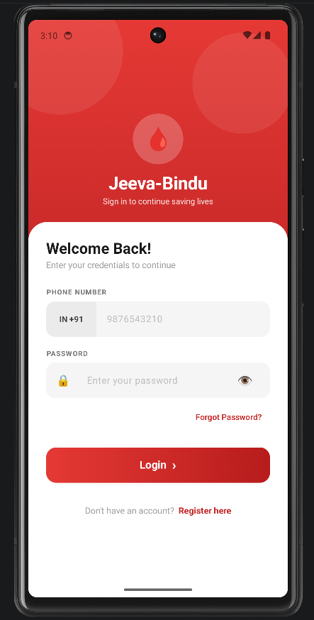
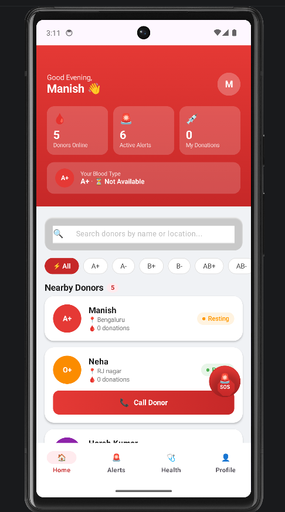
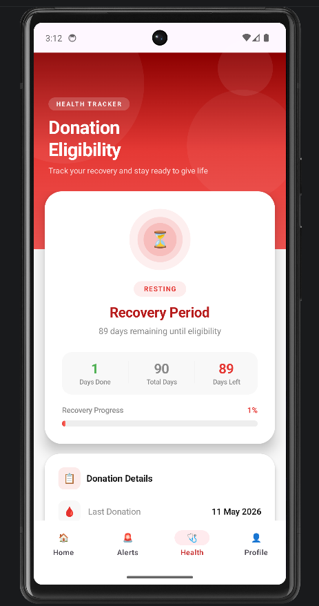

# 🩸 JeevaBindu – Blood Donation & Healthcare App

JeevaBindu is a modern Android application built using **Jetpack Compose** and **Firebase** that connects blood donors with people in urgent need of blood.  
The app focuses on fast donor discovery, emergency blood alerts, health tracking, and donor management to support life-saving blood donations.

---

# ✨ Features

## 🔐 Secure Authentication
- Firebase Authentication based login & registration
- Secure user access and session management
- Simple onboarding experience

## 🩸 Donor Management
- Create and manage donor profiles
- Add blood group, location, and contact details
- Update donor availability status

## 🚨 Emergency Blood Alerts
- Real-time blood request notifications
- Firebase Cloud Messaging (FCM) integration
- Instant SOS alert system

## 📍 Location-Based Donor Search
- Find donors nearby using Panchayat/town filtering
- Search donors by name or location
- Blood group-based filtering system

## ❤️ Donation & Recovery Tracking
- Track donation history
- Recovery period eligibility tracker
- Monitor days left until next donation eligibility

## 📚 Health Awareness
- Blood donation safety guidelines
- Health tips and awareness resources
- Donation preparation information

---

# 📱 App Screens

- Login & Registration
- Home Dashboard
- Nearby Donor Listing
- Emergency Alerts
- Health Tracker
- User Profile Management

---

# 🛠️ Tech Stack

| Technology | Usage |
|------------|-------|
| Kotlin | Main programming language |
| Jetpack Compose | Modern Android UI Toolkit |
| Firebase Authentication | User Authentication |
| Firebase Firestore | Cloud Database |
| Firebase Cloud Messaging (FCM) | Push Notifications |
| Material 3 | UI Design System |
| MVVM Architecture | App Architecture Pattern |

---

# 🧱 Architecture

The project follows modern Android development best practices:

- MVVM Architecture
- Clean Code Principles
- State Management with Compose
- Firebase Cloud Backend
- Reusable Components
- Modular UI Design

---

# 📸 Screenshots

| Login Screen | Home Dashboard | Health Tracker |
| :---: | :---: | :---: |
|  |  |  |

> **Note:** To display these images, ensure you have a `screenshots/` folder in your root directory containing `login.png`, `home.png`, and `health.png`.

---

# 📦 Installation & Setup

## Prerequisites

Make sure you have:

- Android Studio Koala or above
- Firebase Project Setup
- Android SDK installed
- `google-services.json` file

---

# 🚀 Clone Repository

```bash
git clone https://github.com/manish23092003/Jeeva_Bindu-Healthcare-.git
```

---

# ▶️ Run the Project

1. Open the project in Android Studio
2. Sync Gradle files
3. Add Firebase configuration
4. Connect emulator/device
5. Click Run ▶️

---

# 🔥 Firebase Setup

This project uses:

- Firebase Authentication
- Firebase Firestore
- Firebase Cloud Messaging

## Steps

1. Create a Firebase project
2. Add Android app
3. Download `google-services.json`
4. Place it inside:

```bash
app/google-services.json
```

5. Enable:
   - Authentication
   - Firestore Database
   - Cloud Messaging

---

# 📂 Project Structure

```bash
JeevaBindu/
│
├── app/
├── screens/
├── components/
├── viewmodel/
├── firebase/
├── utils/
└── assets/
```

---

# 🚀 Future Improvements

- Live location tracking
- AI-based donor recommendation
- Hospital integration
- Dark mode support
- Multi-language support
- Donation analytics dashboard

---

# 🤝 Contributing

Contributions are welcome.

## Steps to Contribute

1. Fork the repository
2. Create a new branch
3. Commit changes
4. Push your branch
5. Open a Pull Request

---

# 📄 License

This project is licensed under the MIT License.

---

# 👨‍💻 Developer

## Manish Soni

Android Developer | Kotlin | Jetpack Compose | Firebase

GitHub:  
https://github.com/manish23092003

---

# ⭐ Support

If you like this project, consider giving it a ⭐ on GitHub.
